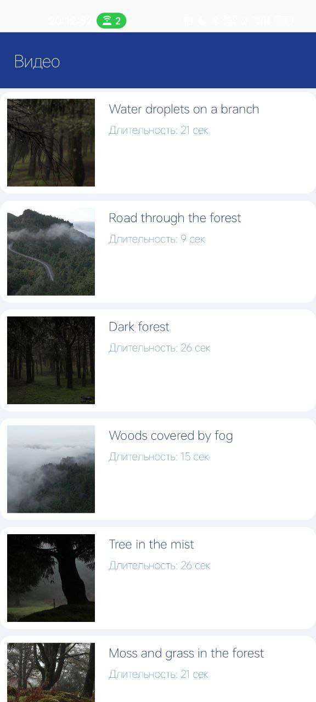
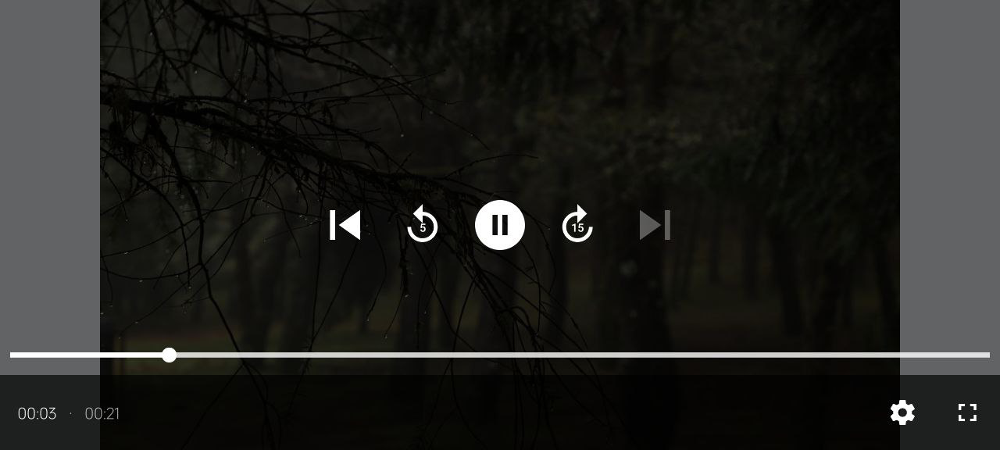

# Видео приложение (VK Internship Test Task)

## Описание
Приложение для просмотра видео с поддержкой автоматического переключения в полноэкранный режим и сохранением состояния воспроизведения. Используется **Coverr API** для получения видео, **ExoPlayer** для воспроизведения видео и **Room** для хранения результатов запросов.

## Функциональность
- На главном экране отображается список видео
- Для каждого видео должна отображаться миниатюра (thumbnail), название и продолжительность
- Загрузка видео из **Coverr API**
- Возможность "потянуть вниз" для обновления списка
- При нажатии на видео из списка открывается экран просмотра.
- Автоматическое переключение в полноэкранный режим при изменении ориентации устройства в горизонтальное
- Сохранение состояния воспроизведения (позиция видео, пауза/воспроизведение) при смене ориентации
- Прогресс-бар с перемоткой, отображение текущего времени и длительности видео
- Имеется обработка ошибок и покрытие тестами (UI и unit)
- Настроена голубая тема 

## Технологии
- **Архитектура**: Clean Architecture + MVVM
- **UI**: Compose
- **Сеть**: Retrofit 
- **База данных**: Room
- **Многопоточность**: Kotlin Coroutines + Flow
- **DI**: Koin
- **Навигация**: Jetpack Navigation 
- **Плеер**: ExoPlayer
- **Управление системными панелями**: WindowInsetsControllerCompat

## Установка и запуск
1. Клонировать репозиторий:
   ```sh
   git clone https://github.com/manwoodt/myMusic.git
   ```
2. Открыть проект в **Android Studio**
3. Запустить на эмуляторе/устройстве

## Архитектура проекта
```
📂 app
📂 domain          # Бизнес-логика (UseCases, модели)
📂 data            # Репозитории, API, БД
📂 presentation    # UI, ViewModel
```

## API
Используется **Coverr API**:
- Поиск видео: `https://api.coverr.co/videos?urls=true`

## Проблемы и их решения

1. Хранение API-ключа
- Проблема: Необходимо было безопасно хранить API-ключ для доступа к внешним сервисам.

- Решение: Ключ был вынесен в gradle.properties,хранящийся локально + зашифрован с помощью EncryptedSharedPreferences чтобы избежать его попадания в публичный репозиторий

2. Загрузка превью через Coil
- Проблема: Изначально использовалась библиотека Coil для загрузки превью видео, но она не обеспечивала необходимый функционал.

- Решение: Переход на Glide

3. Ограничения VK API
- Проблема: Планировалось использовать VK API для загрузки видео, но сервисный API-ключ оказался недостаточным для доступа к методам, таким как video.get. Я решил не усложнять приложение дополнительной аутентификацией для получения клиентского Api ключа.

- Решение: Отказ от VK API в пользу альтернативного сервиса, который не требует сложной аутентификации.

4. Управление системными панелями
- Проблема: Требовалось скрывать статус-бар и навигацию (нижняя полоска) в полноэкранном режиме.

- Решение: Использование WindowInsetsControllerCompat для управления системными панелями.

## Скриншоты

### Главный экран


### Полноэкранный режим


## Видео

